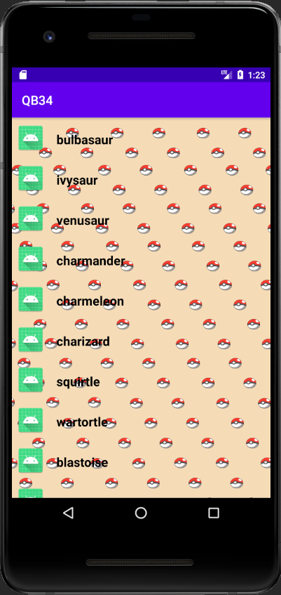
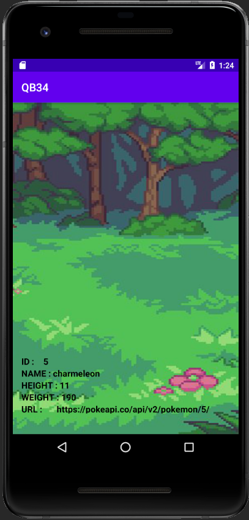

# 3A-Prog-Mobile-Projet

Création d'une application mobile affichant une liste d'éléments ainsi que leur détails

## Installation

* Avoir [Android Studio](https://developer.android.com/studio) d'installé
* Récupérer la branche Master de ce projet

## Notation

### Notions abordées 

* Appels **REST**
* Écran : 2 activités
* Liste affichée à l'aide d'une **RecyclerView**
* Tentative de **Gitflow**
* Fonctions supplémentaires :  
  - Mise en cache des données
  - **MVC**
  - **Design Patterns**
  - Principes **SOLID**
  - **Singleton**

### Screenshot 

***Liste des éléments à afficher***  

***écran des détails lors d'un click sur un élément de la liste***  

## Auteur

* **Bernigaud Quentin** Étudiant à l'[ESIEA](https://www.esiea.fr) 
* Projet effectué en 3ème année

## API

Vous pouvez trouver l'API originale que j'utilise [ici](https://pokeapi.co/api/v2/pokemon)  
Cependant [voici](https://github.com/QuentinBernigaud/3A-Prog-Mobile-Projet/blob/master/pokeapi.json) l'API modifiée par moi-même que j'utilise dans ce projet
